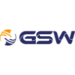
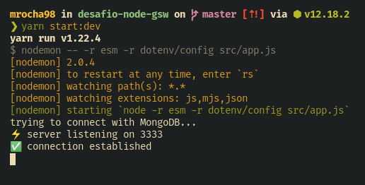
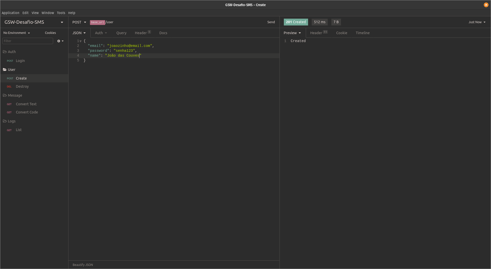
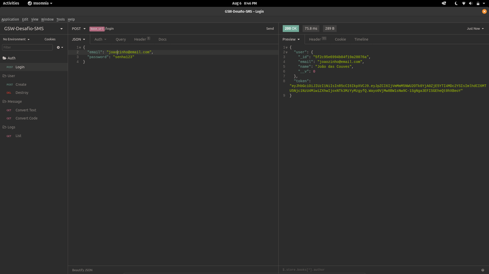
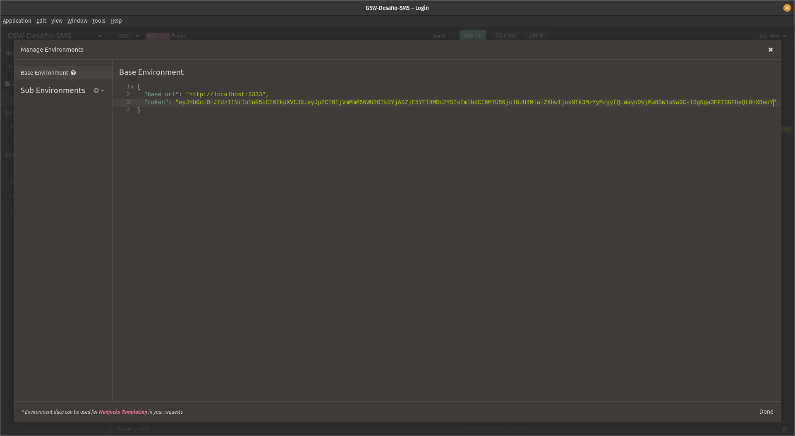
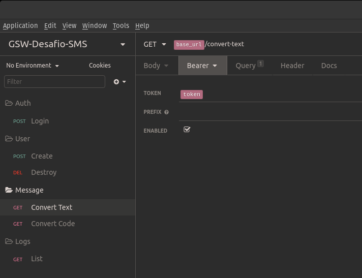
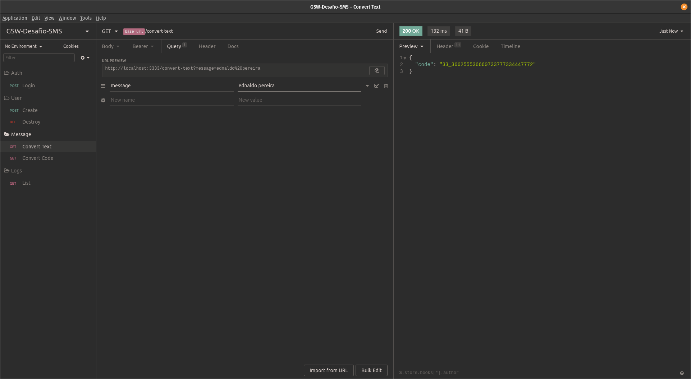
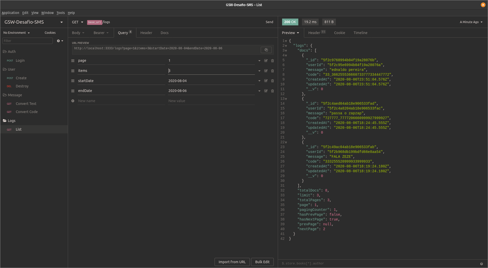

<div align="center">
    <h1>Desafio NodeJS - Conversor de SMS</h1>
    
</div>

<p align="center">
  

  

  

  
</p>

<div align="center">
  <a href="https://insomnia.rest/run/?label=desafio-node-gsw-sms&uri=https%3A%2F%2Fraw.githubusercontent.com%2Fmrocha98%2Fdesafio-node-gsw%2Fmaster%2Fexamples%2Finsomnia_desafio_node_gsw.json" target="_blank"></a>
</div>

## 🎯 Objetivo

Criação de uma api em NodeJS para conversão de texto em código SMS. Todas as conversões realizadas pelo usuário devem ser registradas em um banco Mongo.

Para mais detalhes, consulte o [enunciado](avaliacao_estags.md).

## 📋 Requisitos

- [NodeJs](https://github.com/nvm-sh/nvm) - versão v12 (LTS) ou posterior
- [Yarn](https://yarnpkg.com/)
- [Docker](https://docs.docker.com/get-docker/)
- [Docker Compose](https://docs.docker.com/compose/install/)

## 🚀 Executando a aplicação

Clone o repositório no local de sua preferência

`git clone git@github.com:mrocha98/desafio-node-gsw.git`

Entre no diretório e instale as dependências

```bash
cd desafio-node-gsw
yarn install
```

Crie o arquivo .env e copie o conteúdo do arquivo .env.example para dentro dele

`cp -r .env.example .env`

Troque os valores que julgar necessário e preencha as variáveis referentes ao banco de dados. Segue uma sugestão:

```
DATABASE_PORT=27019
DATABASE_NAME=gsw-sms
DATABASE_USER=mafagafo
DATABASE_PASS=gsw123
DATABASE_HOST=0.0.0.0
```

Inicie o MongoDB
```bash
docker-compose pull
docker-compose up -d
docker-compose logs
```

Assim que o Mongo estiver pronto para receber conexões, inicie a aplicação em modo de desenvolvimento

`yarn start:dev`

Se tudo ocorreu bem, você terá algo próximo disso



## 🔃 Workflow

Crie um usuário



Autentique-se



Atualize o token no Base Environment



Certifique-se de habilitar a autenticação Bearer Token nos próximos endpoints



Converta textos/códigos por meio dos query params



Confira os logs



## 📝 Licença

Esse projeto foi desenvolvido sob a [licença MIT](https://github.com/mrocha98/desafio-node-gsw/blob/master/LICENSE).
